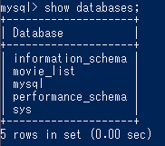
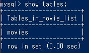
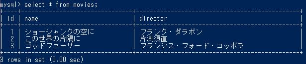
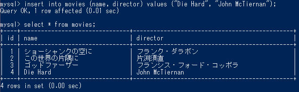
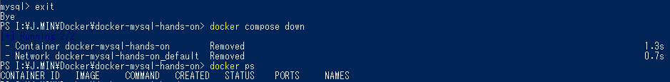

# 第八回課題実施の報告

DockerによるMySQLの構築を行うガイドプロジェクトを実施した。

## 実施内容と結果報告

* Docker compose up -d でコンテナを起動する
```
 docker ps
CONTAINER ID   IMAGE                      COMMAND                  CREATED          STATUS          PORTS                               NAMES
e76cc30abff1   docker-mysql-hands-on-db   "docker-entrypoint.s…"   11 minutes ago   Up 11 minutes   33060/tcp, 0.0.0.0:3307->3306/tcp   docker-mysql-hands-on
```

* MySQLにログインする
```
docker compose exec db mysql -uroot -p
Enter password:
Welcome to the MySQL monitor.  Commands end with ; or \g.
Your MySQL connection id is 8
Server version: 8.0.31 MySQL Community Server - GPL

Copyright (c) 2000, 2022, Oracle and/or its affiliates.

Oracle is a registered trademark of Oracle Corporation and/or its
affiliates. Other names may be trademarks of their respective
owners.

Type 'help;' or '\h' for help. Type '\c' to clear the current input statement.
```

* movie_listがあることを確認する



* moviesテーブルがあることを確認する



* moviesテーブルのレコードを確認する



* テーブルにレコードを追加してみる



* ログアウト・コンテナ停止・停止できていることを確認する


